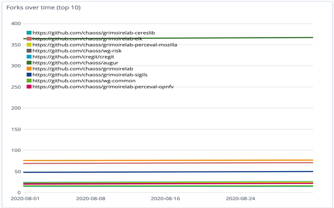

# 技术分支(fork)

问题: 在代码托管平台一个开源项目有多少技术分支(fork)？

## 描述
一个技术分支(fork)是一个项目分布式版本控制的副本。技术分支(fork)数表示在同一代码开发平台上该项目的副本数。

**注意:**  许多时候代码克隆（clone）和 [技术分支（technical fork）](https://github.com/chaoss/translations/blob/main/chinese/wg-common/focus-areas/contributions/technical-fork.md) 可以互换使用，但是两者之间是有区别的。 一个 [技术分支（technical fork）](https://github.com/chaoss/translations/blob/main/chinese/wg-common/focus-areas/contributions/technical-fork.md) 是同一代码托管平台上代码仓的副本, 而 代码克隆（clone）是本地计算机上的副本。

[图片来源于 Stakeoverflow](https://stackoverflow.com/questions/9257533/what-is-the-difference-between-origin-and-upstream-on-github/9257901#9257901)

## 目标
技术分支(fork)度量的目标是确定在代码开发平台上存在的该项目的副本数。对技术分支(fork)的分析可以提供对分支意图的深入了解 (建立分支的不同意图，如对上游有贡献的分支和没有贡献的分支)。

## 实现

__健康指标的使用和传播可能导致隐私侵犯。组织可能会面临风险。这些风险可能来自于遵守欧盟的 GDPR、美国的州法律或其它法律。此外，GitHub 和 GitLab 等数据提供商的服务条款也可能带来合同风险。请务必检查度量指标的使用是否存在风险和潜在的数据伦理问题。请参阅[CHAOSS 数据伦理文件](https://github.com/chaoss/metrics/tree/main/resources)以获得更多指导。__

### 筛选条件
* 时间周期 (例如，每周，每月，每年)  
* 贡献分支与总分支的比率 (贡献分支是指对上游代码仓库建立更改请求的分支。)  
* 非贡献分支与总分支的比率 (贡献分支是指从未对上游代码仓库建立更改请求的分支。)  

### 可视化效果
**Augur 实现**  

**GrimoireLab 实现**  

### 提供度量的工具
* Augur  
* GrimoireLab  

### 数据收集策略
**Github API**  
https://developer.github.com/v3/repos/forks/#list-forks

**GitLab API**  
https://docs.gitlab.com/ee/api/projects.html#list-forks-of-a-project

**Bitbucket API**  
https://developer.atlassian.com/bitbucket/api/2/reference/resource/repositories/%7Bworkspace%7D/%7Brepo_slug%7D/forks

## 参考资料
https://help.github.com/en/enterprise/2.13/user/articles/fork-a-repo
https://opensource.com/article/17/12/fork-clone-difference

## 贡献者
* Vinod Ahuja
* Sean Goggins
* Matt Germonprez
* Kevin Lumbard
* Dawn Foster
* Elizabeth Barron