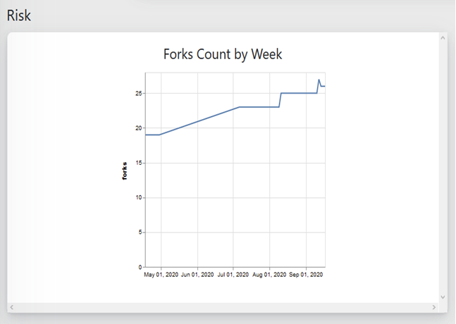

# 技术分支
问题: 在代码开发平台一个开源项目有多少技术分支？

## 描述
一个技术分支是一个项目分布式版本控制的拷贝。技术分支数表示在同一代码开发平台上该项目的拷贝数。

## 目标
技术分支度量的目标是确定在代码开发平台上存在的该项目的拷贝数。对技术分支的分析可以提供对分支意图的深入了解 (建立分支的不同意图，如对上游有贡献的分支和没有贡献的分支)。

## 实现

### 筛选条件
* 时间周期 (例如，每周，每月，每年)  
* 贡献分支与总分支的比率 (贡献分支是指对上游代码仓库建立更改请求的分支。)  
* 非贡献分支与总分支的比率 (贡献分支是指从未对上游代码仓库建立更改请求的分支。)  

### 可视化效果
**Augur 实现**  

**GrimoireLab 实现**  

### 提供度量的工具
* Augur  
* GrimoireLab  

### 数据收集策略
**Github API**  
https://developer.github.com/v3/repos/forks/#list-forks

**GitLab API**  
https://docs.gitlab.com/ee/api/projects.html#list-forks-of-a-project

**Bitbucket API**  
https://developer.atlassian.com/bitbucket/api/2/reference/resource/repositories/%7Bworkspace%7D/%7Brepo_slug%7D/forks

## 参考资料
https://help.github.com/en/enterprise/2.13/user/articles/fork-a-repo
https://opensource.com/article/17/12/fork-clone-difference
