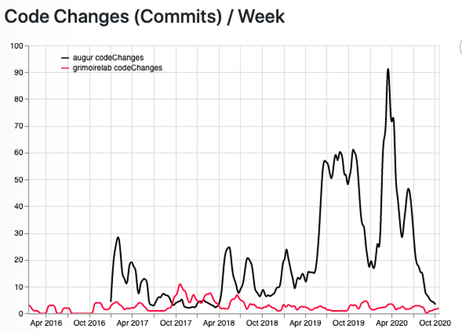

# 突发性波动

问题: 如何在项目中观察到一个活动在短时间的突发性波动，然后相应地恢复到这个活动的正常状态?

## 描述
有多种原因可能会促使代码仓库中的某个活动的总量突然增加或减少。这些增加和减少都表现为该活动相对于平均活动量的突然变化。突发性是一种了解现有指标中活动周期的方法，例如问题、合并请求、邮件列表、代码提交或评论。某个活动突发性变化的根本原因的示例包括:

 - 发布周期
 - 全球流行病
 - 黑客松活动
 - 导师计划
 - 展示工具的会议、聚会和其他活动
 - 传统和社交媒体的公告和提及
 - 引起人们高度关注的关键Bug
 - 为解决特定问题的社区设计会议或头脑风暴会议
 - 社区成员来自于另一个依赖你项目(例如，依赖项)的社区

## 目标
 - 确定活动突发性波动的根本原因的影响
 - 当项目活动在不知不觉中上升时提高意识
 - 帮助捕捉某个项目活动增加或减少的意义
 - 帮助社区和维护者为遵循某种规律的未来突发性波动做好准备
 - 帮助衡量有影响力的外部活动对本社区的影响
 - 区分非正常活动与正常活动

## 实现
### 筛选条件
 - 标星
 - 分支
 - 问题或者bug报告
 - 标签
 - 下载
 - 发布标签
 - 变更请求
 - 邮件列表流量
 - 文档添加或修订
 - 新建代码仓库
 - 新功能请求
 - 消息对话
 - 传统和社交媒体活动
 - 会议出席和提交

### 可视化效果

Augur:

GrimoireLab:

### 提供度量的工具
- Grimoire Lab
- Augur

### 数据收集策略
- 定量
  * 基于时间框识别偏离某种常规状态的活动
  * 某些阈值的异常值，使用布林带等统计数据来衡量稳定性或波动性: https://en.wikipedia.org/wiki/Bollinger_Bands

- 定性调查问题
  * 为什么你在某一段时间内贡献量更多?
  * 你认为这些特有突发性波动的根本原因是什么?
  * 不同事件(例如, 黑客松，导师计划，或者会议)对项目活动有什么影响?

## References
该指标的灵感来自 Goh 和 Barabasi (2008): https://arxiv.org/pdf/physics/0610233.pdf
