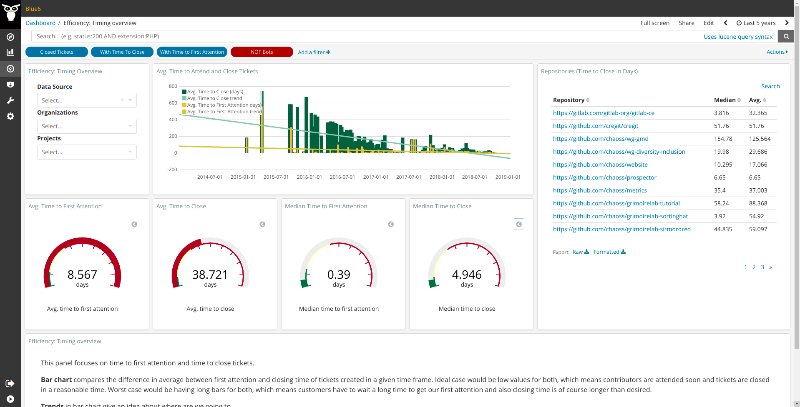
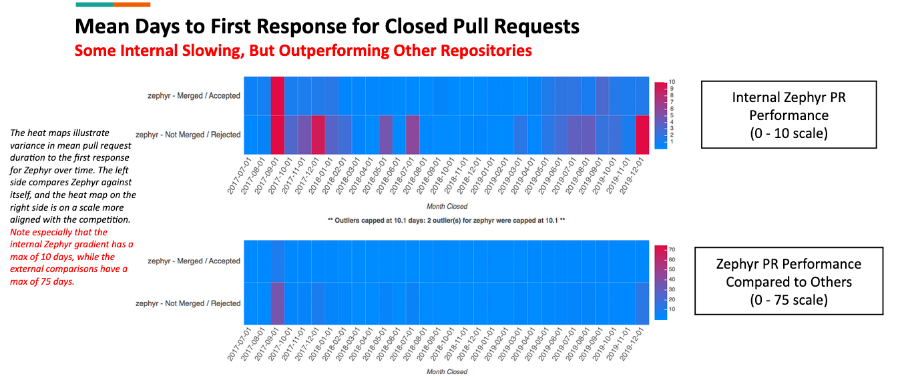

# 第一响应时长

问题：对于需要关注的活动，从创建到第一次响应需要多长时间？

## 描述

对活动的首次响应有时可能是最重要的响应。 首次响应表明社区活跃并且积极参与沟通。 如果对活动的响应时间较长，可能表示社区不够积极。 短时间内对活动做出响应，有助于吸引更多成员参与社区内的进一步讨论。

## 目标

确定各种活动的首次响应节奏，涉及 PR、问题、电子邮件、IRC 帖子等。对于项目的新贡献者、长期贡献者以及整体项目健康情况，首次响应时长都是一项重要考虑因素。

## 实现

活动的首次响应时长 = 首次响应发布到活动的时间 - 活动创建时间。

### 筛选条件

* 回复者的角色，例如，只计算维护者的响应
* 自动响应，例如，通过筛选排除机器人和其他自动回复，只统计真人回复
* 活动类型，如问题（见指标[问题响应时间](https://github.com/chaoss/wg-evolution/blob/master/metrics/Issue_Response_Time.md)）、电子邮件、聊天信息、变更请求

### 可视化效果

---------

---------

### 提供指标的工具

* GrimoireLab 面板：[效率时序总览](https://chaoss.github.io/grimoirelab-sigils/panels/efficiency-timing-overview/)
* [Kata Containers 仪表板效率面板](https://katacontainers.biterg.io/app/kibana#/dashboard/cbbdd920-288c-11e9-b662-975152e57997)

## 参考资料

