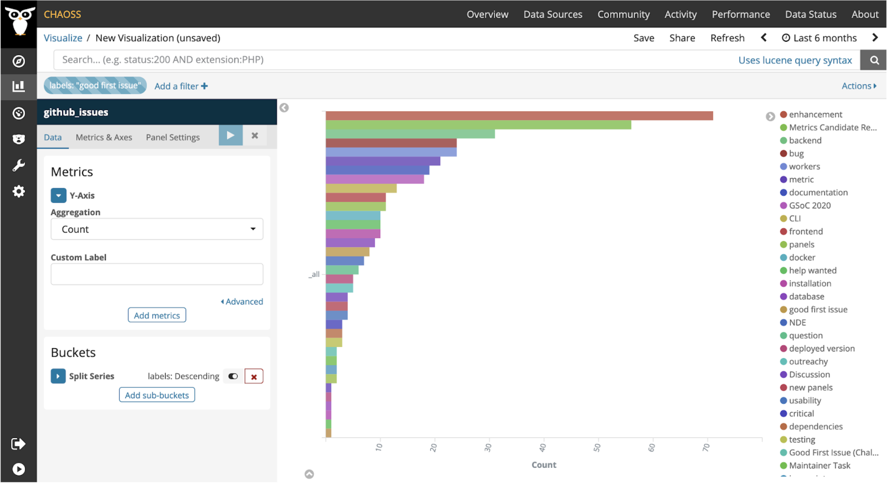
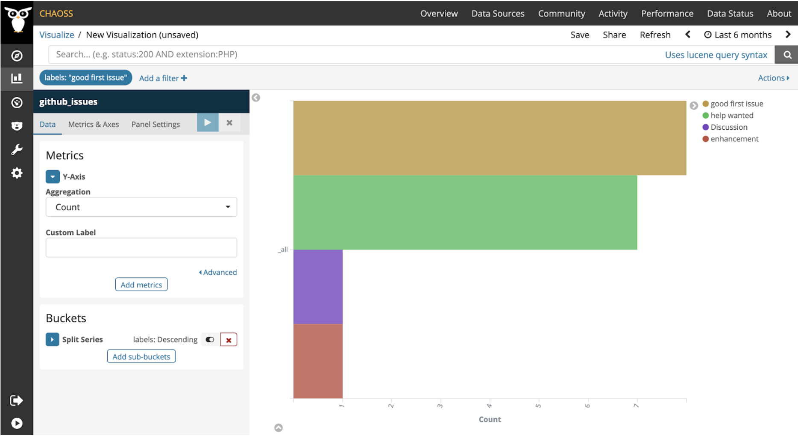
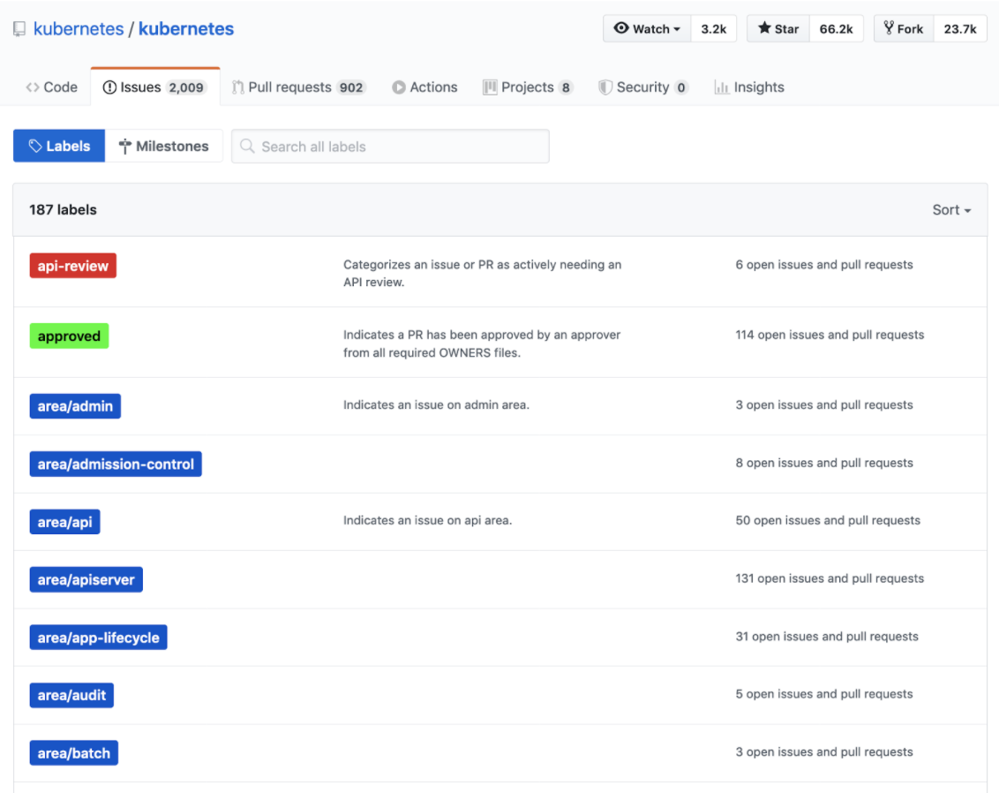

# 问题标签包容性

问题：对于邀请新贡献者、熟练贡献者、非代码贡献者和其他类型贡献者来说，项目问题标注得如何？

## 描述
问题标签包容性有助于衡量不同熟悉程度（如新人、偶尔贡献者和核心贡献者）、不同技能（如语言、框架、API、文档、前端和后端）、不同目标（如代码和非代码贡献）的贡献者对问题的承受能力。

## 目标

*__新人友好__*：问题包括妥善标注的问题（例如，“良好的首次问题”，“新人友好”），供新贡献者入门

*__导师支持__*：问题确定一位导师，为特定问题的审查过程提供指导和帮助（例如，“可提供导师”标签）

*__问题列表多元化__*：问题提供了与不同类型贡献（代码和/或非代码）有关的多元化标签列表（例如，“文件”标签）

*__可用标题和描述__*：问题标题和描述遵循文档可用性指标目标

*__标签的一致使用__*：问题一致使用带有明显颜色的标签特定列表。 例如，每个标记系列都有不同的颜色：

- 问题类型：“功能”与“错误”与“文档”…
- 问题技能：解决问题所需的技能（例如 js、html、css）
- 问题熟悉程度：提及所需的最低熟悉程度（“适合新人”或“偶尔贡献者”或“核心贡献者”…）

## 实现

#### 筛选条件

- 标签类型
- 仓库类型
- 待解决问题的时长
- 待解决问题的数量
- 创建问题的日期
- 代码相关问题与文档相关问题

#### 可视化效果
 

 来自：https://github.com/kubernetes/kubernetes/labels

#### 提供指标的工具:
- Grimoire Lab
- Augur

### 数据收集策略

- 为每个项目确定所用问题标签的发布清单
   - *一般标签*：
      - 在项目的标签列表和问题列表（使用中的标签）中，存在识别“特性”、“错误”和“文档”标签、“前端”和“后端”标签的一般需求的标签
   - *包容性标签*：
     - 新人友好型会在项目的标签列表和问题列表（使用中的标签）中查找（*新人*、*第一次*）
     - 导师友好型会在项目的标签列表和问题列表（使用中的标签）中查找（*导师*）

  - *技能标签*：
     - 在项目的标签列表和问题列表（使用中的标签）中，存在识别所需技能的标签（如 Java、Python、HTML、机器学习）

- 观察项目中各个问题所用每个标签的频率

## 参考资料
- [GitHub Satellite](https://githubsatellite.com/)
