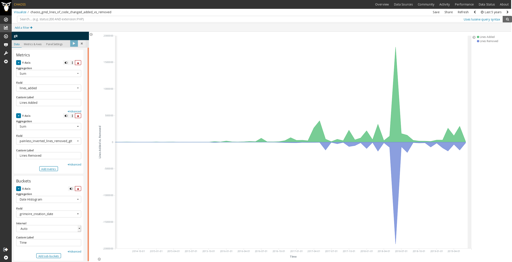

# 代码变更行数

问题：在一段时间内对源代码的所有更改中，所触及的行数之和（增加的行数加上移除的行数）是多少？

## 描述

在引入对源代码的更改时，开发者会触及（编辑、添加、移除）源代码文件的多行修改。 此指标考虑的是一段时间内对源代码更改所触及的行数的总和。 这意味着，如果某个文件中的某一行在三次不同的变更中被触及，这将算作三行。 由于在大多数源代码管理系统中，难以或无法准确判断一行是被移除后再被添加的还是仅被编辑的，所以我们将编辑一行视为移除后再添加新内容。 （移除和添加）每一种都会被视为“触及”。 因此，如果某个文件中的某一行被编辑了三次，则算作六次不同的变更（三次移除，三次添加）。

为此，我们认为源代码的变更如[代码变更](https://github.com/chaoss/wg-evolution/blob/master/metrics/Code_Changes.md)所定义。 代码行将是源代码文件的任何一行，包括注释和空行。

## 目标

* 编码活跃度：
  虽然代码变更可以作为项目编码活跃度的一个维度，但并非所有变更都相同。 关注所有变更中触及的行数的总和，可以补充说明变更规模，通常即为编码活跃度的规模。

## 实现

__健康指标的使用和传播可能导致隐私侵犯。组织可能会面临风险。这些风险可能来自于遵守欧盟的 GDPR、美国的州法律或其它法律。此外，GitHub 和 GitLab 等数据提供商的服务条款也可能带来合同风险。请务必检查度量指标的使用是否存在风险和潜在的数据伦理问题。请参阅[CHAOSS 数据伦理文件](https://github.com/chaoss/metrics/tree/main/resources)以获得更多指导。__

**聚合器：**
* 计数。 一段时间内变更（触及）行的总数。

**参数：**
* **时间段：**开始日期和完成日期。 默认：永久。  
  需要统计的变更所处的时期段。 
* **源代码标准；算法默认：**所有文件均为源代码。  
  如果我们专注于源代码，则需要一个标准来确定一个文件是否为源代码的一部分。 
* **源代码变更类型：**
    - 添加的行
    - 移除的行
    - 空格

### 筛选条件

* 按参与者（作者、提交者）。 需要将参与者合并（合并同一作者的对应 ID）。

* 按参与者群组（雇主、性别…）。 需要将参与者分组，并且可能需要将参与者合并。

* 按[标签](https://www.odoo.com/documentation/13.0/reference/guidelines.html#tag-and-module-name)（用于提交的消息）。 需要提交消息的结构。 在开源项目中，此标记可用于和每个贡献者交流，例如，提交是错误修复或功能改进的情况。

## 可视化效果

* 一段时间内每个月的计数
* 一段时间内每个群组的计数

可以用条形图表示，X 轴为时间。 每个条形代表一定时间（如一个月）内的代码变更。

### 提供度量的工具

* [GrimoireLab](https://chaoss.github.io/grimoirelab) 支持此指标，开箱即用。
  - 查看 [Bitergia Analytics 的 CHAOSS 实例](https://chaoss.biterg.io/app/kibana#/dashboard/f13af0e0-18e5-11e9-ba47-d5cbef43f8d3)示例。
  - 从 [GrimoireLab Sigils 面板集合](https://chaoss.github.io/grimoirelab-sigils/chaoss-gmd-cde/lines_of_code_changed/)下载并导入包含此指标可视化效果示例的现成仪表板。
  - 按照说明向任意 GrimoreLab Kibiter 仪表板添加一个示例可视化效果：
    * 新建一个 `Area` 图
    * 选择 `git` 索引
    * Y 轴 1：`Sum` 聚合，`lines_added` 字段，`Lines Added` 自定义标签
    * Y 轴 2：`Sum` 聚合， `painless_inverted_lines_removed_git` 字段，`Lines Removed` 自定义标签
    * X 轴：`Date Histogram` 聚合，`grimoire_creation_date` 字段，`Auto` 间隔，`Time` 自定义标签
  - 屏幕截图示例： 
    
    

### 数据收集策略

**具体描述：Git**

对于 git，“代码变更”和“变更日期”的定义如[代码变更](https://github.com/chaoss/wg-evolution/blob/master/metrics/Code_Changes.md)所详述。 变更的日期可以定义为作者日期或相应 git 提交的提交者日期（基于这两者情况发生在或不在一段时间内的考虑）。

由于 git 以差异补丁（添加和移除的行列表）的形式提供变更，所以差异中提及的每一个添加的行或移除的行都将被视为变更（触及）的行。 如果行被移除后又被添加，则视为两次“对行的变更”。

__强制性参数：__

* 日期类型。 作者日期或提交者日期。 默认：作者日期。  
  对于每个 git 提交，都会保留两个日期：撰写提交的日期和提交到仓库的日期。 为了确定时间段，必须选择其中一项。 

* 包括合并提交。 布尔值。 默认：True。  
  合并提交是指合并一个分支的提交，在某些情况下不被认为反映编码活动

## 参考资料

* https://www.odoo.com/documentation/13.0/reference/guidelines.html#tag-and-module-name
