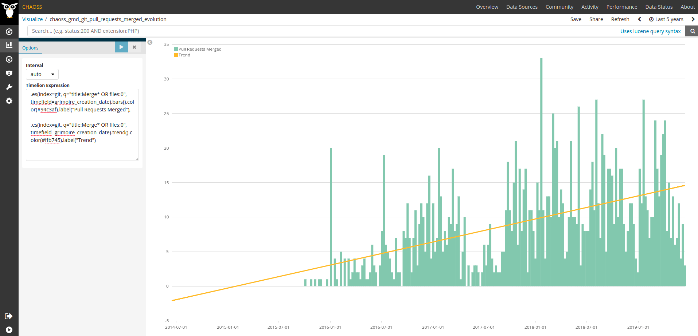

# 接受的变更请求

问题：在一次代码变更中存在多少接受的变更请求？

## 描述

变更请求如 [变更请求](https://chaoss.community/metric-change-requests/)中定义。 接受的变更请求是指相应变更最终合并到项目代码库的变更请求。 接受的变更请求可以链接到源代码的一个或多个变更，对应于提出后最终合并的变更。

例如，在 GitHub 中，当一个 pull request 被接受时，所有包含在其中的提交都会被合并（也许被 squashed，也许被 rebased）到相应的 git 仓库。 GitLab 的 merge request 同样适用。 对于 Gerrit，一次 code review 通常对应一次提交。


## 目标

* 编码活跃度。接受的变更请求是项目活动度的一个维度。 统计一个项目对应的仓库集中接受的变更请求，可以让你了解该项目中导致实际变更的整体编码活动。 当然，该指标不是唯一用于跟踪编码活跃度的指标。


## 实现

**聚合器：**

* 计数。 一段时间内接受的变更请求的总数。
* 比率。 一段时间内接受的变更请求占变更请求总数的比率。

**参数：**
* 时间段。 考虑接受的变更请求的开始日期和结束日期。 默认：永久。

* 源代码标准。 算法。 默认：所有文件均为源代码。  
  如果我们专注于源代码，则需要一个标准来确定一个文件是否为源代码的一部分。


### 筛选条件

* 按参与者类型（提交者、审阅者、合并者）。 需要合并同一参与者对应的身份。
* 按参与者群组（雇主、性别…涉及每个参与者）。 需要参与者分组，并且可能需要参与者合并。


### 可视化效果

* 一段时间内每个周期的计数
* 一段时间内每个周期的比率

可以通过应用上述定义的筛选条件，按参与者类型或参与者群组进行分组。 可以用条形图表示，X 轴为时间。 每个条形代表一定时间（如一个月）内更改代码的接受的 reivew 。


### 提供度量的工具

* [Grimoirelab](https://chaoss.github.io/grimoirelab) 为 GitHub 拉取请求开箱即用地提供该指标，还为 GitLab 合并请求和 Gerrit 变更集提供构建类似可视化效果的数据。
  - 查看 [Bitergia Analytics 的 CHAOSS 实例](https://chaoss.biterg.io/app/kibana#/dashboard/a7b3fd70-ef16-11e8-9be6-c962f0cee9ae)示例。
  - 基于 GitHub 拉取请求数据，从 [GrimoireLab Sigils 面板集合](https://chaoss.github.io/grimoirelab-sigils/panels/github-pullrequests/)下载并导入包含此指标可视化效果示例的现成仪表板。
  - 按照说明向任意 GrimoreLab Kibiter 仪表板添加一个 GitHub 拉取请求的示例可视化效果：
    * 新建一个 `Timelion` 可视化效果。
    * 选择 `Auto` 作为间隔。
    * 粘贴以下 Timelion 表达式：
    ```
    .es(index=git, q="title:Merge* OR files:0", timefield=grimoire_creation_date).bars().color(#94c3af).label("Pull Requests Merged")
    ```
    * 表达式的所有步骤：
      * `.es()`：用于定义 ElasticSearch 查询。
        * `index=git`：使用 git 索引。
        * `q="title:Merge* OR files:0"`：在合并中启发式筛选。
        * `timefield=grimoire_creation_date`：时间将基于提交的创建日期（因为我们的查询是寻找合并提交，所以应为合并有效完成的日期）。
      * `.bars()`：绘制条形而非线条。
      * `.color()` 和 `.label()`：一些格式设置选项。
    * 如果您还想要获得趋势，请改用（即重复两次相同的表达式，第二次调用 `trend()`）：
    ```
    .es(index=git, q="title:Merge* OR files:0", timefield=grimoire_creation_date).bars().color(#94c3af).label("Pull Requests Merged"),
    .es(index=git, q="title:Merge* OR files:0", timefield=grimoire_creation_date).trend().color(#ffb745).label("Trend")
    ```
    * 如[上文所述 GitHub 情况](#specific-description-github)，有时难以识别合并。 您可能已经注意到，在此示例中，我们的表达式基于 GrimoireLab 的 Git 索引。 此外，它还可以应用于使用 Git 仓库的任意相似环境，而不仅仅是 GitHub。
  - 屏幕截图示例： 
   
    


### 数据收集策略

**具体描述：GitHub**

在 GitHub 的情况下，接受的变更请求定义为“变更包含在 git 仓库中的拉取请求”，前提是它提出对源代码文件的变更。

然而，接受变更请求的方式不止一种，并不是所有方式都能让人容易地识别出变更请求是否被接受。 拉取请求被接受并合并是最简单的情况（或变基，或压缩并合并）。 在这种情况下，可以很容易地确定拉取请求是否被接受，并通过对 GitHub API 的查询找到相应提交。

但也可以关闭变更请求，并在 git 仓库中手动合并提交。 在这种情况下，提交仍然可以在 git 仓库中找到，因为其哈希值与拉取请求在 GitHub API 中的相同。

在更困难的情况下，也可以关闭变更请求，手动将提交变基，或压缩后合并。 对于这些情况，哈希值是不同的，只能通过日期和作者的近似匹配和/或比较差异来跟踪 git 仓库中的提交。

从确定是否被接受的角度来看，问题在于如果其被手动包含在 git 仓库中，那么确定拉取请求被接受的唯一方法就是在 git 仓库中找到相应的提交。

在某些情况下，项目具有在关闭拉取请求时提及提交的政策（比如“接受提交 xxx 和 yyyy 而关闭”），这可能有助于跟踪 git 仓库中的提交。

强制性参数（对于 GitHub）：

* 启发式检测未通过 web 接口接受的已接受拉取请求。 默认：无。

**具体描述：GitLab**

在 GitLab 的情况下，接受的变更请求定义为“变更包含在 git 仓库中的合并请求”，前提是它提出对源代码文件的变更。

强制性参数（对于 GitLab）：

* 启发式检测未通过 web 接口接受的已接受拉取请求。 默认：无。

**具体描述：Gerrit**

在 Gerrit 的情况下，接受的变更请求定义为“变更包含在 git 仓库中的变更集”，前提是其提出对源代码文件的变更。

强制性参数（对于 Gerrit）：无。


## 参考资料

