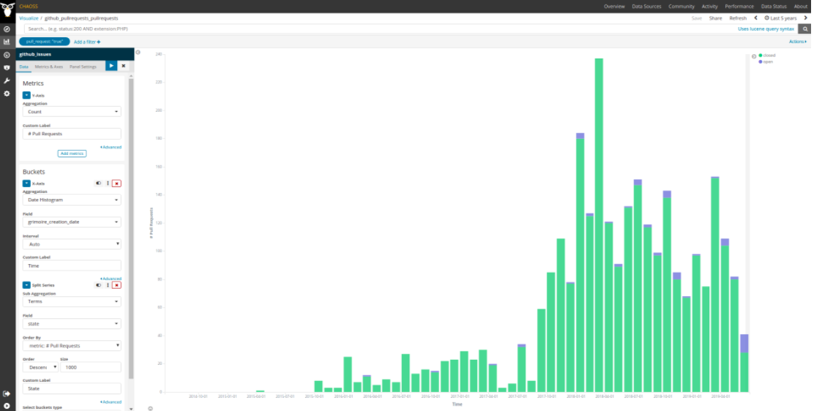

# 变更请求

问题：在一段时间内发生了哪些新的变更源代码的请求？

## 描述
当项目采用代码变更请求流程时，变更并不直接提交至代码库，而是先以“源代码变更提案”的形式进行讨论。 每一次提交都应由其他开发者审查，这些开发者可能会提出改进建议，让原始提议者发送新版本的提案，直到取得肯定的审查结果，接受代码，或者直到提案被拒绝。

例如，“变更请求”在 GitHub 中对应“拉取请求（Pull Request）”，在 GitLab 中对应“合并请求（Merge Request）”，在 Gerrit 中对应“代码审查（Code Review）”，或在某些语境对应“变更集（changesets）”。

## 目标
* 项目中变更请求的数量。 变更请求是项目活动度的一个维度。 统计一个项目对应的代码仓集合中的变更请求数量，可以让你了解该项目中变更的整体活跃度。 当然，该指标不是唯一用于跟踪编码活跃度的指标。

## 实现

**聚合器：**
* 计数。 一段时间内变更请求的总数。

**参数：**

* 时间段。 开始日期和完成日期。 默认：永久。  
  需要统计的变更所处的时期段。

* 源代码标准。 算法。 默认：所有文件均为源代码。  
  如果我们专注于源代码，则需要一个标准来确定一个文件是否为源代码的一部分。

### 筛选条件

* 按参与者（提交者、审阅者、合并者）。 需要将参与者合并（合并同一作者的对应 ID）。
* 按参与者群组（雇主、性别…涉及的每个参与者）。 需要将参与者分组，并且可能需要参与者合并。
* 状态（打开，关闭）

### 可视化效果

* 一段时间内每个月的计数
* 一段时间内每个群组的计数

可以用条形图表示，X 轴为时间。 每个条形代表一定时间（如一个月）内更改代码的变更请求。

### 提供指标的工具

* [Grimoirelab](https://chaoss.github.io/grimoirelab) 为 GitHub 拉取请求、GitLab 合并请求和 Gerrit 变更集开箱即用地提供该指标。
  - 查看 [Bitergia Analytics 的 CHAOSS 实例](https://chaoss.biterg.io/app/kibana#/dashboard/GitHub-Pull-Requests)示例。
  - 基于 GitHub 拉取请求数据，从 [GrimoireLab Sigils 面板集合](https://chaoss.github.io/grimoirelab-sigils/panels/github-pullrequests/)下载并导入包含此指标可视化效果示例的现成仪表板。
  - 屏幕截图示例： 
   
    

### 数据收集策略

**具体描述：GitHub**

对于 GitHub，变更请求定义为“拉取请求（Pull Request）”，前提是其提出对源代码文件的变更。

变更请求的日期可以定义为（基于这两者情况发生在或不在一段时间内的考虑）拉取请求的提交日期。

**具体描述：GitLab**

对于 GitLab，变更请求定义为“合并请求（Merge Request）”，前提是其提出对源代码文件的变更。

变更请求的日期可以定义为（基于这两者情况发生在或不在一段时间内的考虑）合并请求的提交日期。

**具体描述：Gerrit**

对于 Gerrit，定义为“代码审查（Code Review）”，某些上下文中为“变更集（changesets）”，前提是其提出对源代码文件的变更。

变更请求的日期可以定义为（基于这两者情况发生在或不在一段时间内的考虑）通过提交补丁集进行变更请求而开始审查的日期。

## 参考资料
