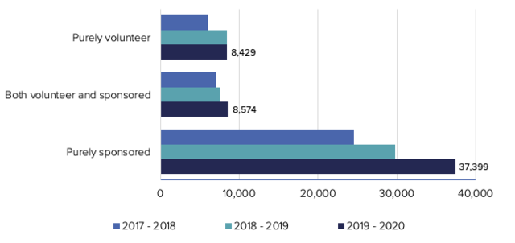

# 贡献归属

问题: 谁对开源项目做出了贡献，对一个贡献相关个人和组织的归属信息是如何分配的？

## 描述
这个指标评估谁参与了项目和具体的项目任务，并提供项目贡献者和所属组织的归属信息。其目的是通过洞察社区的有偿贡献动态，来了解“工作是如何完成的”。

## 目标
1. 谁在做这个项目？
2. 志愿者工作、有偿工作和混合工作（志愿者与有偿工作混合）的比例是多少？What is the ratio of volunteer work, sponsored work, and blended work?
3. 有多少贡献是有偿做出的？
4. 谁赞助了这些贡献？
5. 哪些[类型](https://chaoss.community/metric-types-of-contributions/)的贡献是被赞助的？
6. [在一个项目中，贡献者的社区多样性如何？](https://github.com/chaoss/wg-diversity-inclusion/tree/master/demographic-data)

## 实现
大多数贡献都可以使用跟踪数据隐式地进行属性化，这些属性在其他度量中得到反映。然而，这个度量很大程度上依赖于贡献者自愿提供并由项目领导解释的数据。这个度量的实现要求循环中的人确定哪些组织以及哪些个人贡献者做出了贡献。每个独立的贡献者都应该有机会指出哪些公司、基金会、项目和/或客户为特定的贡献付费。

### 过滤条件

* [贡献者类型 (个人，组织，性别，种族，全球状态，工作地点)](https://chaoss.community/metric-contributors/)
    * 志愿者
    * 由公司和/或客户赞助
    * 贡献者在项目中扮演的[角色](https://www.drupal.org/project/drupalorg/issues/3214849)(例如，维护者，董事会成员等)
* [贡献类型](https://chaoss.community/metric-types-of-contributions/)
    * 在相关的地方，链接到贡献交付件，如合并请求、议题等。
    * 指出 Git 平台中没有管理到的贡献类型，如 GitHub、 GitLab 和 BitBucket。
    * 参见: https://chaoss.community/metric-types-of-contributions/
* 志愿者 vs 有偿贡献 - 涉及到 [组织多元化](https://chaoss.community/metric-organizational-diversity/)与[人力投资](https://chaoss.community/metric-labor-investment/)

### 可视化效果

### 提供指标的工具

1. Drupal 社区构建了这个工具，并在[2015](https://www.drupal.org/blog/who-sponsors-drupal-development)年开始使用, 并[每年](https://dri.es/who-sponsors-drupal-development-2020)公布结果。
2. 在 [Gitlab有一个打开的议题](https://gitlab.com/gitlab-org/gitlab/-/issues/327138)来实现这个功能。

### 数据收集策略
The Drupal Community implemented an example of how to gather information necessary for this metric to be calculated. It associates individuals, and organizations those individuals indicate as warranting attribution, for each discrete contribution.
Drupal 社区实现了一个例子，说明如何收集计算这个度量所必需的信息。它将个人和这些人表示需要归属的组织与每一个独立的贡献联系起来。

### 数据伦理的考虑
虽然这个指标需要捕捉个人和他们所做贡献之间的关系，但这个指标的目的不是为了衡量个人。我们的目的是让大家更广泛地了解对这个项目的贡献是如何被激励的。明确地说，本指标的目的不是要对个人贡献者的工作进行游戏化。

## 参考资料
* https://dri.es/a-method-for-giving-credit-to-organizations-that-contribute-code-to-open-source
* https://www.drupal.org/blog/who-sponsors-drupal-development
* https://dri.es/who-sponsors-drupal-development-2020
* https://gitlab.com/gitlab-org/gitlab/-/issues/327138

## 贡献者
* Matthew Tift
* Sean Goggins
* Elizabeth Barron
* Vinod Ahuja
* Armstrong Foundjem
* Kevin Lumbard
