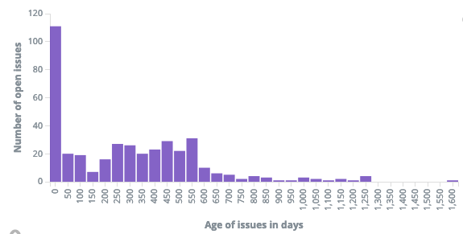

# 议题时长

问题：未解决议题有多长时间处于未解决状态？

## 描述
这一指标表明在考虑的时间段内，议题有多长时间处于未解决状态。 如果一个议题已解决，但在这段时间内又重新变为未解决，则将其视为自最初发布为未解决的日期以来一直为未解决状态。

## 目标
当议题时长不断增加时，找出项目中时间最长的未解决议题，深入了解为什么这些议题长时间都未能解决。 此外，要了解维护者解决议题的水平和速度。

## 实现
对于所有未解决议题，获取议题发布为未解决的日期，计算距当前日期的天数。

**聚合器：**
* 平均数。 所有未解决议题的平均时长。
* 中位数。 所有未解决议题的中位时长。

**参数：**
* 时间段。 考虑未解决议题的开始日期和结束日期。 默认：永久（即项目议题活动的整个可观察时段）。

### 筛选条件
* 模块或工作组
* 议题标记/标签

### 可视化效果

1. 未关闭的issue汇总数据
   
   

2. 每天未关闭issue的数量
   
   

### 提供度量的工具

* [GrimoireLab](https://chaoss.github.io/grimoirelab/)
* [Augur](http://augur.osshealth.io/api_docs/#api-Evolution-Open_Issue_Age_Repo_)

### 数据收集策略

关于收集已关闭issue数据的具体说明，请参阅[“新issue”的对应部分](https://chaoss.community/metric-issues-new/)。

## 参考资料
