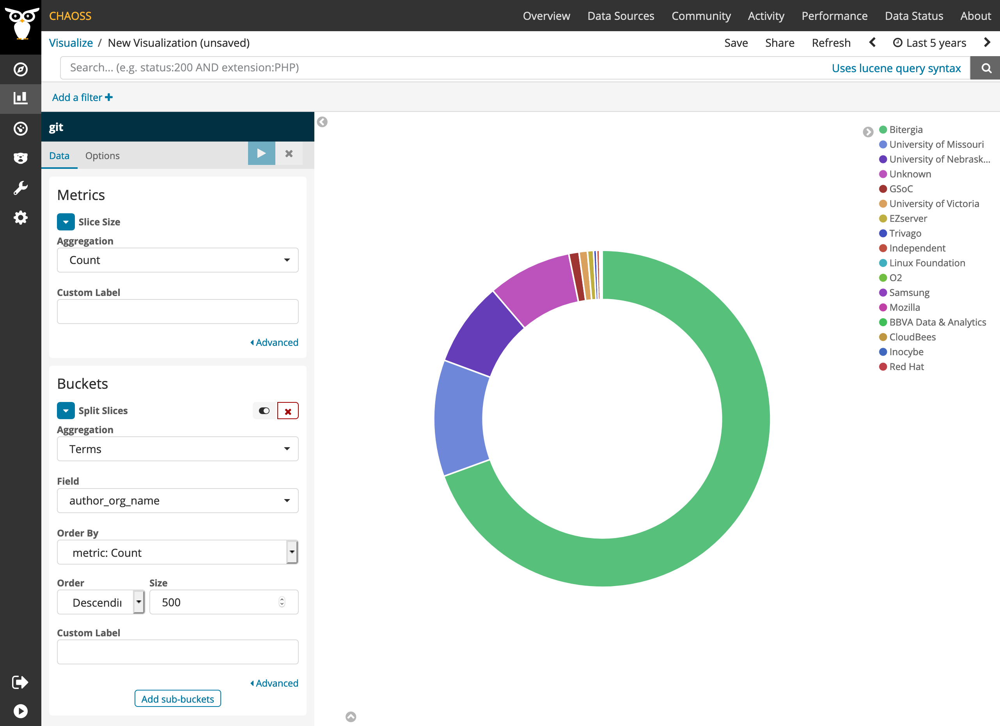

# 大象系数

问题：社区的工作分配是怎样的？

## 描述

公司员工对软件仓库中的总提交比例进行可参数化定义，这些公司的最低数量即为项目的“大象系数”。 例如，一种常见筛选方法是，如果 50% 的提交是由 `n 家公司`完成，即为大象系数。 从最大的贡献组织开始，加总到参数化百分比，然后是下一个最大的组织，以此类推。 例如一个项目有 8 个贡献组织，每个组织在项目中贡献了 12.5% 的提交，如果将大象系数参数化为 50%，那么大象系数为“4”。 如果其中一个组织在同样的场景中负责 50% 的提交，那么大象系数就是“1”。

大象系数提供了一个简单易行的指标，表明执行一定比例（即 50%）工作的公司的最低数量。 “大象系数”一词的起源在文献中并没有明确划分，不过它可能源于 Venters 等人 (2014) 对软件可持续性作为关键非功能性软件需求的普遍认同。

## 目标

一家公司在评估开源软件产品时，可能会使用大象系数比较项目对一小部分企业贡献者的依赖程度。 大象系数低的项目在直观上更容易被一个企业的决策串联到任何消费该工具的企业。 对于 1000 个组织贡献的项目和可能只有 10 个组织贡献的项目，参数化筛选条件应该有合理区分。 在一定的组织贡献量下（可能少于 1000 个组织），大象系数很可能不是软件采购的核心考虑因素，因为明智的管理者会使项目不易被少数参与者的决定所影响。 此类阈值很大程度上取决于具体环境。

## 实现

大象系数的计算公式是百分比的计算 - 它将是我们的阈值 - 然后每个公司的贡献按降序相加，直到达到阈值。

如果我们有 8 个组织，每个组织为项目贡献的提交数量：`1000, 202, 90, 33, 332, 343, 42, 433`，那么我们可以首先得出所有公司总提交的 50% 来确定大象系数。

**汇总：**总贡献的 50% = `1,237.5`，因此大象系数为 `2`。

**完整解答：**
1. 降序排列数据：`1000, 433, 343, 332, 202, 90, 42, 33`
2. 计算总数的 50%：
   -  `(1,000 + 433 + 343 + 332 + 202 + 90 + 42 + 33) * 0.5 = 1,237.5`
3. 将排名前两位的公司相加，得到 `1,433`。
4. **回答**：对于 `1,433 > 1,237.5`，超过 50% 的贡献仅由 `2` 家公司完成，因此 `大象系数 = 2`。

### 筛选条件

* 时间：如果先前时间段存在快照，大象系数就会适度地发生变化。因此，产品生命周期中的大象系数可能会错误地代表项目支持的当前组织多元化水平。
* 仓库组：许多开源项目包括多个仓库，在某些情况下，检查与给定项目相关的所有仓库可以更全面地了解大象系数。

### 提供指标的工具

1. [Augur](https://github.com/chaoss/augur)
2. [GrimoireLab](https://chaoss.github.io/grimoirelab) 提供此指标，开箱即用，非单一数字而是可视化效果。
  - 查看 [Bitergia Analytics 的 CHAOSS 实例](https://chaoss.biterg.io/app/kibana#/dashboard/Git)示例。
  - 从 [GrimoireLab Sigils 面板集合](https://chaoss.github.io/grimoirelab-sigils/panels/git/)下载并导入包含此指标可视化效果示例的现成仪表板。
  - 按照说明向任意 GrimoreLab Kibiter 仪表板添加一个示例可视化效果：
    * 新建一个 `Pie` 图
    * 选择 `git` 索引
    * 指标切片大小：`Count` 聚合
    * 桶剪接切片：`Terms` 聚合，`author_org_name` 字段，`metric: Count` 排序依据，`Descending` 排列，`500` 大小
  - 屏幕截图示例： 

## 参考资料

1. Colin C. Venters, Lydia Lau, Michael K. Griffiths, Violeta Holmes, Rupert R. Ward, Caroline Jay, Charlie E. Dibsdale, and Jie Xu. 2014. The Blind Men and the Elephant: Towards an Empirical Evaluation Framework for Software Sustainability. Journal of Open Research Software 2, 1. https://doi.org/10.5334/jors.ao
2. http://philslade.blogspot.com/2015/07/what-is-elephant-factor.html
3. https://blog.bitergia.com/2016/06/07/landing-the-new-eclipse-open-analytics-dashboard/
4. https://www.stackalytics.com/
