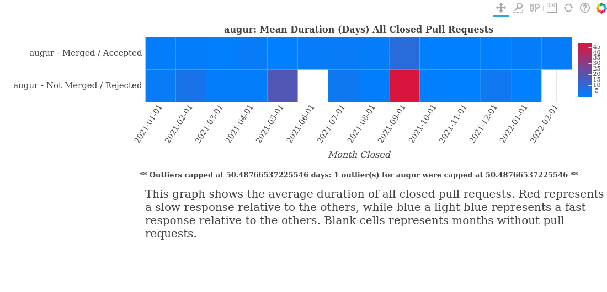
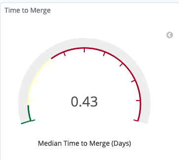

# 缺陷解决时间

问题: 一旦缺陷被报告和记录，项目需要多少时间来解决？ 

同义词: Bug 

## 描述
从向项目报告缺陷(使用项目的缺陷报告机制)到项目解决缺陷的中位数时间是多少？注意，处理方案可以是解决(解决及合并) ，并更新对用户可用方案，或者显式选择不处理(拒绝)。
 
注意: 
1. 这一定义界定了修复何时被接受(合并到公共主分支或发布)或被拒绝的结束时间，用以与正式发布软件的时间形成对比(这使得只有少数用户关心修复的缺陷得以解决)。例如，被认为已解决的缺陷，关闭的相关报告(例如，议题)必须链接到合并的更改请求或其他代码更改，包括构建指令(编译器标志或其他构建时配置项)。
2. 并非所有的报告/议题都是准确的，许多准确的报告/问题并不是缺陷(例如，特性请求和客户支持请求)。
3. 通过快速拒绝所有缺陷报告，一个项目似乎有一个快速响应时间，就好像这些报告没有描述缺陷一样。此外，恶意报告者还可以制造大量虚假的缺陷报告。这个度量并不试图捕捉那些情况; 度量用户应该看看是否实际存在上述情况。
4. 用于表示缺陷的标签各不相同，缺陷解决分析需要考虑被检查的项目集合上使用的标签。
5. 我们的目的不是把这个指标当作服务水平协议（SLA），因为开源项目是由志愿者维护的，解决时间因项目不同而不同，取决于活跃的维护者。

缺陷包括软件中任何不能正常工作的地方(例如，按照规定)。由开发操作错误引起的部署问题不被视为软件缺陷。

## 目标
1. 为了了解从收到缺陷报告到软件用户可以获得缺陷解决方案之间需要多少时间。
2. 为了了解开源项目中的单个项目、代码库或项目组合的总体缺陷解决时间的平均值、中值或其他统计度量
    1. 缺陷报告通常有异常值，例如，一个低重要性的缺陷可能很难报告，因此需要很长的时间来修复。这就是我们推荐中位数作为主要衡量标准的原因。
    2. 了解跨相关代码仓、组织或项目集合的缺陷解决方案。

## 实现
__健康指标的使用和传播可能导致隐私侵犯。组织可能会面临风险。这些风险可能来自于遵守欧盟的 GDPR、美国的州法律或其它法律。此外，GitHub 和 GitLab 等数据提供商的服务条款也可能带来合同风险。请务必检查度量指标的使用是否存在风险和潜在的数据伦理问题。请参阅[ CHAOSS 数据伦理文件](https://github.com/chaoss/metrics/tree/main/resources)以获得更多指导。__

大多数主要的 Git 平台都有“问题跟踪系统”，其中的特性请求、缺陷和部署支持问题不会自动区分。过滤器应用于议题、议题标签和其他元数据，以区分缺陷和其他类型的问题。

### 过滤条件 
包含一个过滤条件
* 缺陷解决与代码更改或[更改请求](https://chaoss.community/metric-change-requests/)相关。
* 缺陷解析速度度量，用于指示从缺陷的识别到通过合并[变更请求](https://chaoss.community/metric-change-requests/)而关闭之间的总体(均值、中位)时间。
* 当代码合并为用户可用的版本时，任何被标记为缺陷解决的问题(标签因代码仓而异)。
* GitHub、 GitLab、 Bugzilla、 SourceForge 或任何其他问题跟踪系统使用“issue”代表软件缺陷。
* 与 [变更请求]](https://chaoss.community/metric-change-requests/)相关联, 或者指示出没有被issue相关联的[变更请求](https://chaoss.community/metric-change-requests/)的百分比。 

### 可视化效果
可以修改“Four Keys project”项目，以将关注点放在缺陷的解决和影响上。

来源: 这张图片来自于 [Four Keys project] (https://github.com/GoogleCloudPlatform/fourkeys)

Augur可视化API可应用于对缺陷标签的过滤。 

来源: 这张图片来自于 [Augur](http://augur.chaoss.io/api/unstable/pull_request_reports/Average_PR_duration?repo_id=25440) and http://new.augurlabs.io 

Grimoirelab 可以将缺陷相关的过滤器应用在代码变更请求上。 

来源: 这张图片来自于 [GrimoireLab](https://bit.ly/3vftkc1)

### 提供指标的工具 

* Grimoirelab 
* Augur 
* Four keys - https://github.com/GoogleCloudPlatform/fourkeys

### 数据收集策略 
从议题跟踪平台收集议题，以及相应的标签，并对报告是否反映议题进行初步评估。

## 参考资料
1. [议题响应](https://chaoss.community/metric-issue-response-time/)
2. [关闭时间](https://chaoss.community/metric-time-to-close/)
3. [https://ieeexplore.ieee.org/document/8285884](https://ieeexplore.ieee.org/document/8285884) 

## 贡献者

* Duane O’Brian
* David Wheeler
* Kate Stewart
* Renisha Nellums
* Vinod Ahuja
* Sean Goggins
* Sophia Vargas
