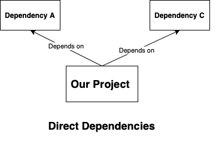
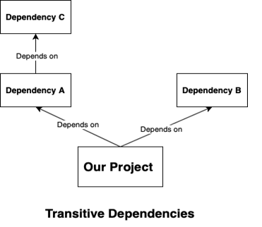

# 上游代码依赖

问题: 我的项目依赖哪些项目和软件库？
## 描述
这个度量的目的是了解一个开源软件中代码的依赖项的数量和类型。这个度量明确地排除了关于基础设施的依赖关系，比如数据库和操作系统，它们将作为一个独特的度量标准来开发。通过扩展，对上游代码依赖性的了解使项目能够使用其他 CHAOSS 指标来评估每个依赖性的健康性和可持续性。

## 目标
上游代码依赖度量指标旨在理解构建、测试或运行一个软件所需代码的依赖关系。上游代码依赖度量指标可以帮助识我的项目直接或者间接依赖哪些项目、软件库或者版本。

## 实现

__健康指标的使用和传播可能导致隐私侵犯。组织可能会面临风险。这些风险可能来自于遵守欧盟的 GDPR、美国的州法律或其它法律。此外，GitHub 和 GitLab 等数据提供商的服务条款也可能带来合同风险。请务必检查度量指标的使用是否存在风险和潜在的数据伦理问题。请参阅[CHAOSS 数据伦理文件](https://github.com/chaoss/metrics/tree/main/resources)以获得更多指导。__

上游代码依赖度量指标可以通过分析项目的依赖文件或使用现有的工具来实现，这些工具可以检查所使用编程语言的包管理器的数据(例如，JavaScript npm使用package.json，Python使用pyproject.toml/requirements.txt，Ruby使用Gemfile/Gemfile.lock等)。注意: C/C++ 通常使用系统包管理器。对于多编程语言混合的项目，情况变得更加复杂，因为需要扫描几个特定于语言的依赖文件。

### 参数
所有枚举的依赖项都应该包括该依赖项的特定版本。请注意，有些系统不支持或不使用“版本锁定”，因此不会使用特定的版本。

* 依赖树的深度
    * 直接依赖 - 第一顺序的依赖，如在源代码和/或软件包管理器配置中所声明的（例如，requirements.txt，Gemfile等）。
    * 可传递依赖 - 间接依赖性，也就是说，超出第一顺序依也称为嵌套或第二顺序依赖。例如，正在评估的项目 a 依赖于项目 b，项目 b 依赖于项目 c。对于项目 a，项目 c 是可传递依赖。 
    * 循环依赖 - 自己最终依赖自己。在允许循环依赖的系统中，我们假设给定的依赖在这种情况下只计算一次。
* 依赖状态
    * 静态依赖 - 依赖存在于所有的情况中。
    * 动态依赖 - 在使用过程中和其他上下文中的依赖发生变化。
* 依赖外部服务，比如使用API
* 执行依赖 - 执行软件所需的依赖性。请注意，某些类型的依赖项通常被排除在计数之外，如下所述。这些可能是下列一项或多项:
    * 构建依赖 - 构建一段软件所需的代码
    * 测试依赖 - 测试一段软件所需的代码
    * 运行依赖 - 运行一段软件所需的代码
* 编程语言运行时依赖细节(例如，Python 的运行环境) ？(预设值为 no)。之所以提供这些细节，是因为在安全关键系统中，运行时的依赖关系对于质量保证非常重要。 
    * 通常情况下，决定哪种编程语言运行是由虚拟环境控制，例如Python中的venv；在Ruby中，你通常会使用[rbenv]([[https://github.com/rbenv/rbenv](https://github.com/rbenv/rbenv))  或者 [rvm]([https://rvm.io/](https://rvm.io/))来实现（&通常包含在 "Gemfile "或 "Gemfile.lock "和.ruby-version中）。
    * PyPi 正在稳步增加它的“拒绝编译不兼容的库/依赖”的逻辑，它开始“破坏构建”。
    * 不幸的是，并非所有的打包系统都有一个记录所有可传递依赖项的版本信息的约定，即使是在它们的生态系统中(从长远来看也应该记录)。
    * 在某些系统中，有许多可能的运行时（runtime）可能难以区分。(例如，Common Lisp 有很多实现，通常任何一个都可以。)
* 语言在 count 中的内置库(例如，Python 中的“ re”) ? (默认值为 no)
    * 通常，许多内置库都是可执行依赖项。然而，它们通常是通过选择编程语言实现时“大量”安装的，并且常常被排除在计数之外，以简化分析。
    *  例如: 默认情况下,`pip freeze`不包括这些“包含在语言中”的软件库/依赖项。
* 相同依赖项的多个版本是独立计算的。有些系统支持系统内同一依赖关系的多个版本; 在这种情况下，它们是分开计算的。

**注意:** 在运行时提供关于编程语言实现的主版本和次版本信息通常很重要。
* 一些计数和分析需要这些信息。通常忽略编程语言的运行时库（runtime libraries）和内置库(见上文) ，这些信息可以作为提供这些附加信息的简写。
* 示例: Ruby 生态系统在 Gemfiles 和.Ruby-version 文件中支持编程语言运行时的版本规范。
* 示例: PyPi 和 Anaconda 的 Python 版本经常以不同的方式管理不同版本的软件库。

### 过滤条件
* 随时间变化的趋势(例如，我依赖的项目比去年多还是少)
* 每个依赖项的版本数
* 引用相同依赖项的数量

### 可视化效果

### 提供度量的工具
* [deps.dev](https://deps.dev/)
* [Deps.cloud](https://deps.cloud/)
* [OWASP](https://owasp.org/www-project-dependency-check/) 
* [Libraries.io](https://libraries.io/)
* [BackYourStack.com](https://backyourstack.com/)
* [Software bill of materials](https://cyclonedx.org/tool-center/) 
* [PackagePhobia](https://github.com/styfle/packagephobia)

### 数据收集策略
* [Augur 有一个代码扫描和包管理器扫描依赖标识的实现。](https://github.com/chaoss/augur/tree/master/workers/deps_worker)
* [Libraries.io 提供一个包管理器专注于依赖扫描 (也可以通过Tidelift使用).](https://libraries.io/rubygems/bibliothecary)

## 参考资料

## 贡献者
* Georg Link
* Matt Germonprez 
* Sean Goggins 
* Sophia Vargas
* Kate Stewart
* Vinod Ahuja 
* David A. Wheeler
* Arfon Smith 
* Elizabeth Barron
* Ritik Malik
* Dhruv Sachdev
* Daune O’Brien
* Michael Scovetta

