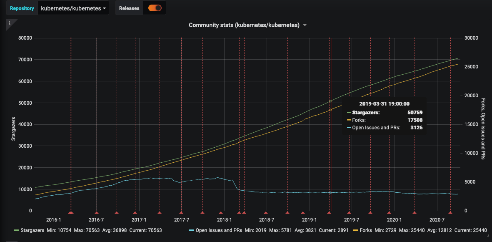

# 项目热度
问题: 开源项目有多受欢迎?  

## 描述
项目受欢迎的程度可以通过项目周围可见的活跃度来衡量，受欢迎度有一个正向反馈循环，热度更高的项目获得更多的关注，吸引更多的开发者或者用户，并能看到热度持续增加，循环往复。

项目受欢迎度可以作为理解项目价值的关键指标，因为开源项目缺乏项目使用信息或者销售信息。

## 目的

为了赚取工资并最大限度的增加未来的就业机会，工作者可能有兴趣了解哪些项目正在增长。同样，从组织的角度来看，了解哪些项目使用率高有助于了解哪些项目可能值得投资。项目流行度指标可用于确定项目的发展轨迹。

## 实现
项目受欢迎成都指标通常会随着时间的推移而发生变化。在根据以下数量衡量项目受欢迎程度时需要考虑大量的示例：

1. 社交媒体
1. 分支(Forks)
1. [变更请求](https://chaoss.community/metric-change-requests/)
1. [新议题](https://chaoss.community/metric-issues-new/)
1. Stars, badges, likes
1. [新的贡献者](https://chaoss.community/metric-new-contributors/)
1. [组织多元化](https://chaoss.community/metric-organizational-diversity/)
1. 项目技能的职位发布
1. 项目内外的交流
1. 项目克隆数量
1. 追随者
1. 下游依赖
1. 参加项目活动的人

### 可视化

来自Cauldron (GrimoireLab)的议题和代码评审（变更请求）可视化：

来自DevStats的Kubernetes项目的流行度统计数据:

### 提供指标的工具
* [Augur](https://github.com/chaoss/augur)
* [GrimoireLab](https://chaoss.github.io/grimoirelab/)
* [Cauldron](https://cauldron.io/)
## 参考
- [受欢迎的开源项目](http://blog.honeypot.io/most-exciting-open-source-projects-2018/)
- [是否得到维护?](https://isitmaintained.com/)
- [开源项目趋势](https://github.blog/2018-02-08-open-source-project-trends-for-2018/)
- [Kubernetes工资](https://www.payscale.com/research/US/Skill=Kubernetes/Salary)

