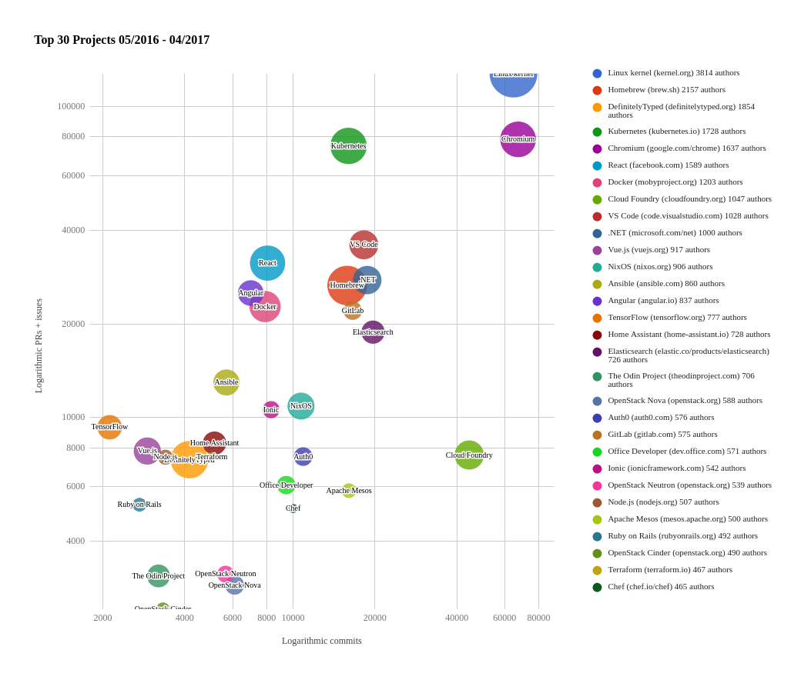

# 项目发展速度

问题：如何衡量组织的发展速度？

## 描述

项目的发展速度是指议题数量、代码提交数量、更改请求数量和贡献者个数，作为“创新”的指标。

## 目标

给开源项目办公室 (OSPO) 经理提供一种通过比较项目组合去衡量项目发展速度的方法。

OSPO 经理可以使用以下项目发展速度指标来：

- 比较开源项目与内部项目的发展速度
- 比较项目组合中的项目发展速度
- 找出哪些项目外部贡献者的发展超出了内部贡献者（在筛选内部贡献者与外部贡献者时）
- 找出值得投入的有前途的领域
- 找出未来几年可能成功的领域

[参见示例](https://www.cncf.io/blog/2017/06/05/30-highest-velocity-open-source-projects)

## 实现

基本指标包括：

- [关闭的问题个数](https://github.com/chaoss/wg-evolution/blob/master/metrics/Issues_Closed.md)
- [评论个数](https://github.com/chaoss/wg-evolution/blob/master/metrics/Reviews.md)
- [修改代码的人数](https://github.com/chaoss/wg-evolution/blob/master/metrics/Code_Changes.md)
- [代码提交人数](https://github.com/chaoss/wg-risk/blob/master/metrics/Committers.md)

### 筛选条件

* 内部与外部贡献者
* 项目来源（例如，内部仓库、开源仓库和竞争对手的开源仓库）
* 时间

### 可视化效果

* X 轴：代码提交的总次数的对数
* Y 轴：提交问题总个数和评论总个数之和的对数。
* 点大小：代码提交人数
* 点为某个项目

[来自 CNCF](https://www.cncf.io/blog/2017/06/05/30-highest-velocity-open-source-projects/)

### 提供指标的工具

* CNCF - https://github.com/cncf/velocity

## 参考资料

- [开源创新能在企业中发挥作用吗?](https://www.threefivetwo.com/blog/can-open-source-innovation-work-in-the-enterprise)
- [高绩效文化的开放式创新](https://www.nearform.com/blog/want-a-high-performing-culture-make-way-for-open-innovation)
- [数字企业的开源](https://www.cio.com/article/3213146/open-source-is-powering-the-digital-enterprise.html)
- [发展最快的开源项目](https://www.cncf.io/blog/2017/06/05/30-highest-velocity-open-source-projects)
