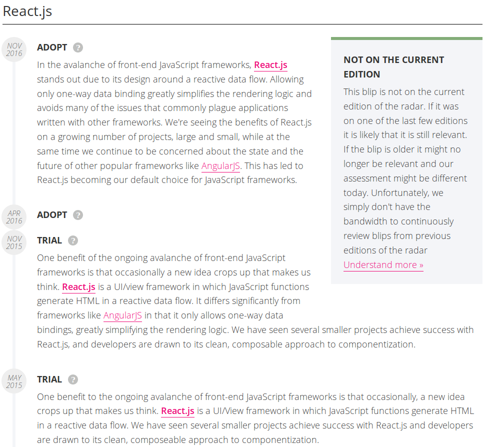

# 组织项目技能需求

问题：有多少组织在使用这个项目？如果我精通这个项目，是否可以雇用我？

## 描述

各组织通过用例和依赖关系来参与开源项目。 该指标旨在确定与开源项目相关的下游技能需求。 该指标着眼于将项目作为 IT 基础设施的一部分进行部署的组织、其他具有声明依赖关系的开源项目，以及通过社交媒体、会议提及、博客文章和类似活动对项目的引用。

## 目标

作为一名开发者，我希望把自己的技术和时间投入到有可能让我在未来获得一份体面薪水的项目中。 人们可以使用项目软件的下游组织影响指标来了解组织使用的项目，由此寻求可能需要 IT 支持服务的工作机会。

## 实现

基本指标包括：
- 为项目创建问题的组织数量
- 为项目创建拉取请求的组织数量
- 发布项目相关博客或推文的组织数量
- 在公开招聘信息中提到项目的组织数量
- 派代表参加项目相关会议的组织数量
- 依赖某项目的其他项目数
- 项目相关书籍的数量
- 项目的 Google 搜索趋势

### 可视化效果

以下可视化效果展示了依赖于特定项目的下游项目的数量。 虽然这种可视化效果未捕捉项目软件下游组织影响指标的整体，但它提供了一部分的可视化效果。

其他可视化效果可能包括 Google 搜索趋势（React vs. Angular vs. Vue.js）。

ThoughtWorks 发布了名为 'Tech Radar' 的系列，展现技术的普及程度。

Tech Radar 让您能够对项目进行深入研究，了解评估随时间的变化。

StackOverview 发布了年度开发者调查

### 提供指标的工具

* Google 趋势 - 显示一段时间内的搜索兴趣
* ThoughtWorks TechRadar - 技术咨询公司的项目评估
* StackOverflow 开发者调查 - 年度项目排名
* Augur；示例可用于多个仓库：
  - [Rails](http://augur.osshealth.io/repo/Rails%20(wg-value)/rails/overview)
  - [Zephyr](http://augur.osshealth.io/repo/Zephyr-RTOS/zephyr/overview)
  - [CloudStack](http://augur.osshealth.io/repo/Apache%20(wg-value)/cloudstack/overview)

## 参考资料

- [开源赞助](https://opensource.org/sponsors)
- [财政赞助和开源](https://opensource.com/article/19/1/fiscal-sponsors-open-source)
- [大型企业开源赞助](https://www.networkworld.com/article/2867020/big-names-like-google-dominate-open-source-funding.html)
- [Google 趋势 API](https://www.npmjs.com/package/google-trends-api)
- [衡量开源软件的影响](https://aisel.aisnet.org/cgi/viewcontent.cgi?article=1496&context=amcis2018)
- [ThoughtWorks Tech Radar](https://www.thoughtworks.com/radar)
- [Stack Overflow 开发者调查](https://insights.stackoverflow.com/survey/2019#technology)
