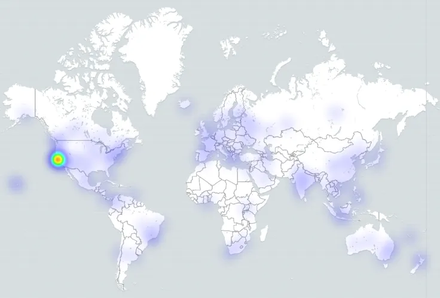

# Ubicación del contribuyente

Pregunta: ¿Cuál es la ubicación de los contribuyentes?

## Descripción

Ubicación geográfica desde la que los contribuyentes realizan sus contribuciones, dónde viven o trabajan.

## Objetivos

Determinar la ubicación global de los contribuyentes con el fin de comprender las prácticas laborales y las zonas horarias. Identificar de dónde no provienen las contribuciones con el fin de actuar para mejorar la participación en estas áreas.

## Implementación

### Filtros

Filtrar contribuciones por:

* **Ubicación.** Intente agrupar ubicaciones en regiones para tener varios niveles de informes. Ubicación es un término deliberadamente ambiguo en este contexto y podría referirse a región, país, estado, localidad o zona horaria.
* **Período de tiempo.** Fecha de inicio y finalización del período. Por defecto: para siempre. Período durante el cual se contabilizan las contribuciones.
* **Tipo de contribuyente**, por ejemplo:
  * Autores de repositorio
  * Autores de incidencias
  * Participantes en la revisión de código
  * Autores de listas de correo
  * Participantes de eventos
  * Autores de IRC
  * Autores de blog
  * Por ciclo de lanzamiento
  * Lenguajes de programación del proyecto
  * Rol o función en el proyecto

### Visualizaciones

Mapa de densidad de puntos:

Fuente: [https://chaoss.biterg.io/goto/a62f3584a41c1c4c1af5d04b9809a860](https://chaoss.biterg.io/goto/a62f3584a41c1c4c1af5d04b9809a860)

Mapa de calor visual:

Fuente:  [https://blog.bitergia.com/2018/11/20/ubers-community-software-development-analytics-for-open-source-offices](https://blog.bitergia.com/2018/11/20/ubers-community-software-development-analytics-for-open-source-offices)

### Herramientas que proporcionan la métrica

*   GrimoireLab
*   Augur

### Estrategias de recopilación de datos

Se pueden utilizar diferentes enfoques para recopilar información sobre la ubicación:

*   Recopilar la información de ubicación a partir del perfil de un contribuyente en el sistema de participación.
*   Utilizar la geolocalización de direcciones IP de las ubicaciones más frecuentes en las que se realizan las contribuciones.
*   Deducir la ubicación geográfica a partir de la marca de tiempo de las contribuciones.
*   Encuestar a los contribuyentes.

El principal desafío a la hora de recopilar datos es determinar la ubicación del contribuyente. La práctica más recomendable sería aprovechar cualquier información de perfil disponible en el sistema de participación y, si no está disponible, utilizar la geolocalización de IP para determinar la ubicación más frecuente de contribución de esa persona. Tenga en cuenta que los contribuyentes pueden introducir en los datos de su perfil información de ubicación falsa o sin sentido (por ejemplo, «La Tierra» o «Internet»). Tenga en cuenta que la geolocalización de IP puede proporcionar una gran cantidad de falsos positivos debido al uso de VPN u otras herramientas de enmascaramiento de IP.

Una consideración adicional sería el uso de herramientas externas de recopilación de datos, como encuestas comunitarias o datos de registro de eventos, que se podrían utilizar como referencias cruzadas con los perfiles de los sistemas de participación. Los datos de ubicación de los contribuyentes se pueden recopilar en línea con los datos [demográficos de los asistentes al evento](https://chaoss.community/metric-attendee-demographics/) y los [datos demográficos de los oradores](https://chaoss.community/metric-speaker-demographics/).

## Referencias

*   González-Barahona, J. M., Robles, G., Andradas-Izquierdo, R., & Ghosh, R. A. (2008). Geographic origin of libre software developers. _Information Economics and Policy_, _20_(4), 356-363.
