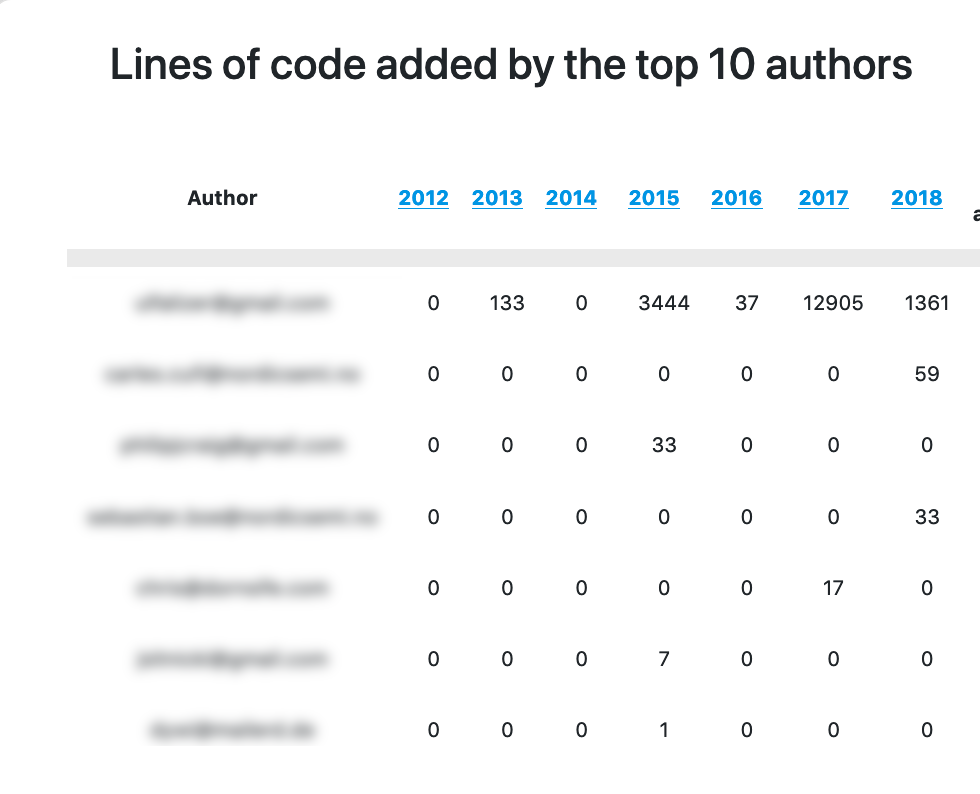

# Contribuyentes

Pregunta: ¿Quiénes son los contribuyentes de un proyecto?

## Descripción

Un contribuyente se define como cualquier persona que contribuya al proyecto de alguna manera. Esta métrica garantiza que todos los tipos de contribuciones se reconozcan plenamente en el proyecto.

## Objetivos

Los proyectos de código abierto se componen de varios contribuyentes diferentes. Reconocer a todos los contribuyentes a un proyecto es importante para saber quién está ayudando con actividades como el desarrollo de código, la planificación de eventos y los esfuerzos de marketing.

## Implementación

Recopile los nombres de los autores a partir de las herramientas de colaboración que utiliza un proyecto.

**Agregadores:**
* Cantidad. Número total de contribuyentes durante un período de tiempo determinado.

**Parámetros:**
* Período de tiempo. Fecha de inicio y finalización del período. Por defecto: para siempre. Período durante el cual se contabilizan las contribuciones.

### Filtros

Por ubicación de la participación. Por ejemplo:
* Autores de «commits»
* Autores de incidencias
* Participantes en revisiones, por ejemplo, en solicitudes de extracción
* Autores de listas de correo
* Participantes de eventos
* Autores de IRC
* Autores de blog
* Por ciclo de lanzamiento
* Marco de tiempo de actividad en el proyecto, por ejemplo, encontrar nuevos contribuyentes
* Lenguajes de programación del proyecto
* Rol o función en el proyecto

### Visualizaciones

1. Lista de nombres de contribuyentes (a menudo con información sobre su nivel de participación)
  

2. Número resumido de contribuyentes
  

3. Cambio en el número de contribuyentes activos a lo largo del tiempo

4. Nuevos contribuyentes (ordenar la lista de contribuyentes por fecha de la primera contribución)

### Herramientas que proporcionan la métrica

* [GrimoireLab](https://chaoss.github.io/grimoirelab/)
* [Augur](http://augur.osshealth.io/api_docs/#api-Evolution-Contributors_Repo_)

### Estrategias de recopilación de datos

Como se indicó anteriormente, parte de la información de los contribuyentes está disponible a través de software como GrimoireLab y Augur. Sin embargo, algunas estadísticas de los contribuyentes se obtienen con menos facilidad a través de datos de seguimiento. En estos casos, las encuestas con miembros de la comunidad o los registros de eventos pueden proporcionar la información deseada. Estos son algunos ejemplos de preguntas que podrían incluir:

* Pregunta de la entrevista: ¿Qué contribuyentes no suelen aparecer en las listas de contribuyentes?
* Pregunta de la entrevista: ¿Qué contribuyentes a menudo se pasan por alto como contribuyentes importantes porque sus contribuciones son menos evidentes?
* Pregunta de la entrevista: ¿Con qué otros miembros de la comunidad trabaja habitualmente?

Además, las encuestas con miembros de la comunidad pueden proporcionar datos que permiten obtener más información sobre las contribuciones al proyecto. Estos son algunos ejemplos de preguntas que podrían incluir:

* Elemento de la escala Likert [1-x]: Estoy contribuyendo al proyecto
* Elemento de la encuesta matriz: ¿Con qué frecuencia participa en las siguientes actividades del proyecto?
  * Encabezados de columna: Nunca, Rara vez (menos de una vez al mes), A veces (más de una vez al mes), A menudo (una vez a la semana o más)
  * Las filas incluyen: a) Crear/Revisar código, b) Crear o mantener documentación, c) Traducir documentación, d) Participar en la toma de decisiones sobre el desarrollo del proyecto, e) Servir como organizador de la comunidad, f) Ser tutor de otros contribuyentes, g) Asistir a eventos en persona, h) Participar a través de programas de informática de la escuela o la universidad, i) Participar a través de un programa como Outreachy, Google Summer of Code, etc., j) Ayudar con las operaciones de ASF (por ejemplo, reuniones de la junta o recaudación de fondos)

## Referencias
