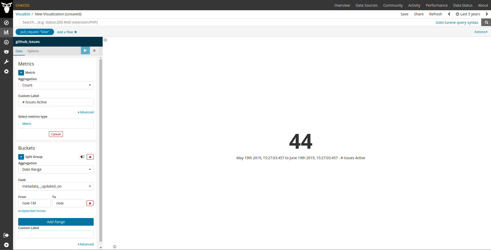

# Incidencias activas

Pregunta: ¿Cuántas incidencias estuvieron activas durante un período determinado?

## Descripción

Las incidencias se definen como en [Incidencias nuevas](https://github.com/chaoss/wg-evolution/blob/master/metrics/Issues_New.md). Las incidencias que muestran alguna actividad son aquellas que tuvieron algún comentario, o algún cambio de estado (incluido el cierre de la incidencia), durante un período determinado.

Por ejemplo, en incidencias de GitHub, un comentario, una nueva etiqueta, o la acción de cierre de una incidencia, se considera como un signo de actividad.

## Objetivos

* Volumen de incidencias activas en un proyecto. Las incidencias activas son un indicador de la actividad en un proyecto. Al contar las incidencias activas relacionadas con el código en el conjunto de repositorios correspondientes a un proyecto, puede tener una idea de la actividad general de trabajo con incidencias en ese proyecto. Por supuesto, esta métrica no es la única que se debe utilizar para realizar un seguimiento de volumen de actividad de codificación.

## Implementación

**Agregadores:**
* Cantidad. Número total de incidencias activas durante el período.
* Proporción. Relación de incidencias activas sobre el número total de incidencias durante ese período.

**Parámetros:**
* Período de tiempo. Fecha de inicio y finalización del período durante el cual se consideran las incidencias. Por defecto: para siempre.

* Criterios para el código fuente. Algoritmo. Por defecto: todas las incidencias están relacionadas con el código fuente.  
  Si nos centramos en el código fuente, necesitamos un criterio para decidir si una incidencia está relacionada con el código fuente o no.

### Filtros

* Por actor (remitente, comentarista, cerrador). Requiere la fusión de identidades correspondientes al mismo autor.
* Por grupos de actores (empleador, género... para cada uno de los actores). Requiere agrupación de actores, y probablemente, fusión de actores.

### Visualizaciones

* Cantidad por grupo a lo largo del tiempo
* Proporción por período a lo largo del tiempo

Estas se podrían agrupar aplicando los filtros definidos previamente. Estas podrían representarse como gráficos de barras, con el tiempo en el eje X. Cada barra representaría propuestas para cambiar el código durante un período determinado (por ejemplo, un mes).

### Herramientas que proporcionan la métrica

* [GrimoireLab](https://chaoss.github.io/grimoirelab) proporciona datos para calcular una métrica cercana a la descrita en esta página para incidencias de GitHub, incidencias de GitLab, Jira, Bugzilla y Redmine. En términos de la métrica, **los datos de GrimoireLab solo tienen la fecha de la última actualización de cada elemento, lo que limita el cálculo de esta métrica a los rangos de tiempo que terminan en la fecha actual**.
  - Dependiendo de la API de origen, la definición de lo que se considera una actualización de la incidencia podría variar. GrimoireLab usa `metadata__updated_on` para almacenar la última actualización de la incidencia. Consulte la [documentación de Perceval](https://perceval.readthedocs.io/en/latest/search.html?q=metadata_updated_on&check_keywords=yes&area=default) para buscar el campo de API específico que se usa en cada caso y comprender sus limitaciones, si las hubiera.
  - Actualmente, no hay ningún panel de control que muestre esto en acción. Sin embargo, es fácil crear una visualización que muestre el número de usos cuya última actividad ocurrió en algún momento entre una fecha y una fecha actual (lo haremos para las incidencias de GitHub aquí).
  - Añada una visualización de muestra a cualquier panel de GrimoreLab Kibiter siguiendo estas instrucciones:
    * Cree una nueva visualización de `Métrica`.
    * Seleccione el índice `github_issues`.
    * Filtro: `pull_request` es `falso`.
    * Métrica: Agregación `Cantidad`, Etiqueta personalizada `# Incidencias activas`.
    * Cubos: Agregación `Rango de fechas`, Campo `metadata__updated_on`, Desde `now-1M` (o cualquier intervalo que se ajuste a sus necesidades), Hasta `now`, dejar la etiqueta personalizada vacía para ver las fechas específicas en la leyenda.
    * Eche un vistazo al selector de tiempo en la esquina superior derecha para asegurarse de que esté configurado para incluir la historia completa de los datos, de modo que no excluyamos ningún elemento en función de su fecha de creación.
  - Captura de pantalla de ejemplo: 
   
  .

### Estrategias de recopilación de datos

**Descripción específica: GitHub**

En el caso de GitHub, las incidencia activas se definen como «incidencias que reciben un comentario, un cambio en las etiquetas, un cambio en la persona asignada o están cerradas».

**Descripción específica: GitLab**

En el caso de GitLab, las incidencia activas se definen como «incidencias que reciben un comentario, un cambio en las etiquetas, un cambio en la persona asignada o están cerradas».

**Descripción específica: Jira**

En el caso de Jira, las incidencia activas se definen como «incidencias que reciben un comentario, un cambio en el estado, un cambio en la persona asignada o están cerradas».

**Descripción específica: Bugzilla**

En el caso de Bugzilla, las incidencia activas se definen como «informes de errores que reciben un comentario, un cambio en el estado, un cambio en la persona asignada o están cerradas».

## Referencias
