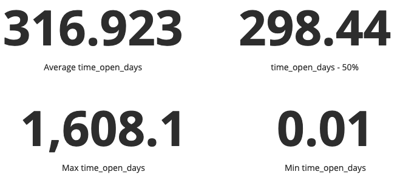

# Antigüedad de la incidencia

Pregunta: ¿Cuánto tiempo han estado abiertas las incidencias?

## Descripción
Esta métrica es un indicativo de cuánto tiempo se han dejado abiertas las incidencias en el período considerado. Si una incidencia se cerró pero se volvió a abrir dentro de ese período, se considerará que ha permanecido abierta desde su fecha de apertura inicial.

## Objetivos
Cuando la antigüedad de la incidencia aumenta, identifique las incidencias abiertas más antiguas de un proyecto para obtener información sobre por qué han estado abiertas durante un período prolongado. Además, comprender cómo de bien están resolviendo las incidencias los mantenedores y cómo de rápido se resuelven las incidencias.

## Implementación
Para todas las incidencias abiertas, obtenga la fecha en que se abrió la incidencia y calcule el número de días hasta la fecha actual.

**Agregadores:**
* Promedio. Promedio de antigüedad de todas las incidencias abiertas.
* Media. Antigüedad media de todas las incidencias abiertas.

**Parámetros:**
* Período de tiempo. Fecha de inicio y finalización del período durante el cual se consideran las incidencias abiertas. Por defecto: para siempre (es decir, todo el período observable de la actividad de la incidencia del proyecto).

### Filtros
* Módulo o grupo de trabajo
* Etiquetas de la incidencia

### Visualizaciones

1. Resumen de datos de las incidencias abiertas  

2. Número de incidencias abiertas por día  

### Herramientas que proporcionan la métrica

* [GrimoireLab](https://chaoss.github.io/grimoirelab/)
* [Augur](http://augur.osshealth.io/api_docs/#api-Evolution-Open_Issue_Age_Repo_)

### Estrategias de recopilación de datos

Para obtener descripciones específicas de la recopilación de datos sobre incidencias cerradas, consulte la sección [correspondiente de Incidencias nuevas](https://github.com/chaoss/wg-evolution/blob/master/metrics/Issues_New.md#data-collection-strategies).

## Referencias
