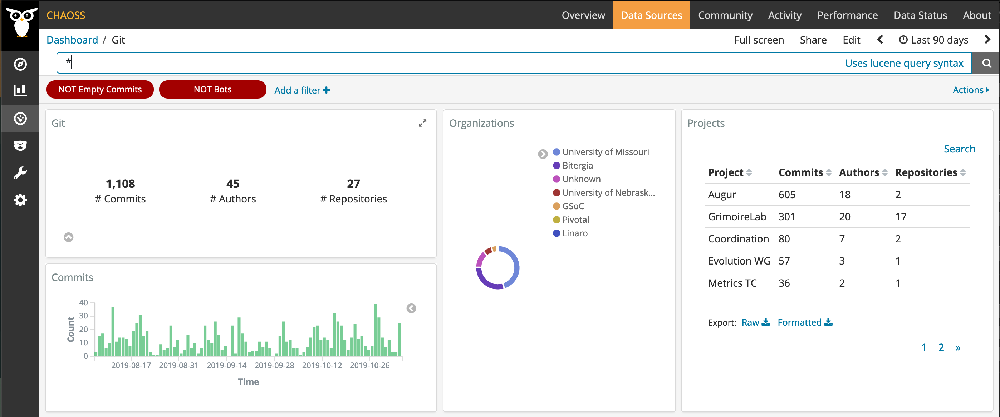
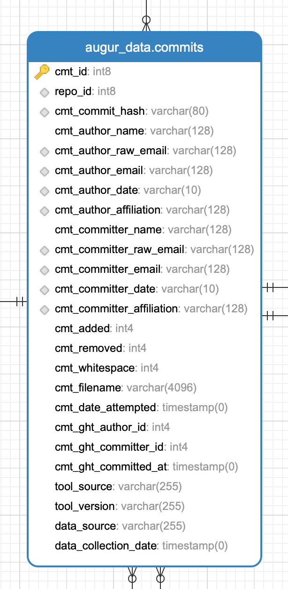

# Committers

Pregunta: ¿Cómo de sólidos son los contribuyentes de una comunidad?

## Descripción
La métrica Committers es el número de personas que han contribuido con «commits» de código en un proyecto. Esta métrica es distinta de la [métrica de CHAOSS más amplia «Contribuyentes»](https://github.com/chaoss/wg-common/blob/master/focus-areas/who/contributors.md), que habla directamente de la única preocupación específica que surge en la evaluación del riesgo por parte de los administradores que deciden qué proyecto de código abierto utilizar.  Si bien no es necesariamente cierto en todos los casos, en general se acepta que cuantos más contribuyentes tenga un proyecto, más probable será que ese proyecto continúe recibiendo actualizaciones, soporte y recursos necesarios. Por lo tanto, la métrica permite a las organizaciones tomar una decisión informada sobre si el número de committers de un proyecto determinado presenta potencialmente un riesgo actual o futuro de que el proyecto pueda ser abandonado o que quede con poco soporte.

## Objetivos

Desde el punto de vista de los administradores que deciden entre proyectos de código abierto para incorporar a sus organizaciones, la cantidad de committers a veces es importante.  Las contribuciones al código, específicamente, pueden variar significativamente de las métricas de contribuyentes a mayor escala (que incluyen autores de documentación, personas que abren incidencias y otros tipos de contribuciones), según el estilo de gestión empleado por un proyecto de código abierto. McDonald et al (2014) llamaron la atención sobre cómo diferentes proyectos de código abierto se llevan a cabo utilizando un modelo abierto y distribuido, mientras que otros se llevan a cabo siguiendo modelos altamente centralizados. Un número pequeño contribuyentes de código puede ser un indicador de que el proyecto está menos abierto a contribuciones externas, o simplemente que se trata de un proyecto que tiene una pequeña cantidad de personas que comprenden y contribuyen a la base del código.

## Implementación

En un proyecto de código abierto, cada dirección de correo electrónico individual que tiene un «commit» fusionado en el proyecto es un «committer» (consulte «problemas conocidos» en la siguiente sección). Es útil identificar la cantidad de committers únicos durante un período de tiempo específico, y la fórmula para hacerlo es sencilla:

`Number_of_committers = distinct_contributor_ids (durante un período de tiempo con una fecha de inicio y una fecha de finalización)`. Por ejemplo, es posible que desee saber cuántas personas distintas han efectuado «commits» de código en un proyecto en los últimos 18 meses. `Committers` revela la respuesta.

### Problemas conocidos con la calidad de los datos
* Muchos contribuyentes usan más de un correo electrónico, lo cual puede elevar artificialmente el número total de committers si estas identidades compartidas no se reconcilian.
* Varios committers que hacen pequeñas contribuciones «de pasada» también pueden elevar artificialmente este número.

### Visualizaciones

De Grimoire Lab mostrando committers



### Filtros
* Tiempo: conocer el número más reciente de committers distintos puede indicar más claramente el número de personas que participan en un proyecto que examinar el número durante la vida de un proyecto (repositorio).
* Tamaño de commit: las confirmaciones pequeñas, medidas por líneas de código, podrían excluirse para evitar un problema conocido
* Cantidad de commits: los contribuyentes con menos de un umbral mínimo de commit en un período de tiempo podrían ser excluidos de este número.

## Herramientas que proporcionan la métrica
Augur mantiene una tabla para cada registro de commit en un repositorio.



Para evaluar los distintos committers de un repositorio, se pueden utilizar los siguientes endpoints SQL o API documentados:
```sql
SELECT
    cmt_author_name,
    COUNT ( * ) AS counter
FROM
    commits
WHERE
    repo_id = 22159
GROUP BY
    cmt_author_name
ORDER BY
    counter DESC
```

Esta expresión permite a un usuario final filtrar por umbrales de recuento de commits fácilmente, y el número de filas devueltas es «Total_Committers» para el repositorio.

[Grimoire Lab](https://chaoss.biterg.io/app/kibana#/dashboard/Git) también proporciona información sobre los committers.

## Referencias
1. Nora McDonald, Kelly Blincoe, Eva Petakovic y Sean Goggins. 2014. Modelado de colaboración distribuida en GitHub. Avances en sistemas complejos 17 (7 & 8).
