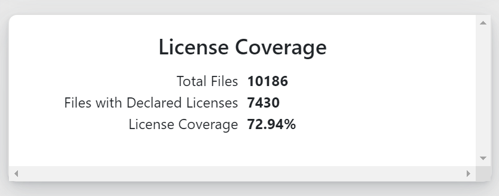

# Cobertura de licencia

Pregunta: ¿Qué parte del código base tiene licencias declaradas?

## Descripción

Qué parte del código base tiene licencias declaradas que los escáneres pueden reconocer y que pueden no estar solo aprobadas por OSI. Esto incluye tanto los archivos fuente de software como de documentación y se representa como un porcentaje de la cobertura total.

## Objetivos

La Cobertura de licencia proporciona información sobre el porcentaje de archivos en un paquete de software que tiene una licencia declarada, lo que lleva a dos casos de uso:
1. Un paquete de software se obtiene para uso organizacional interno y la cobertura de licencia declarada puede resaltar puntos de interés o preocupación al usar ese paquete de software.
2. Además, se proporciona un paquete de software a proyectos externos posteriores, y la cobertura de licencia declarada puede hacer transparente la información de licencia necesaria para la integración, implementación y uso posteriores.

## Implementación

### Filtros

Tiempo: las licencias declaradas en un repositorio pueden cambiar con el tiempo a medida que cambian las dependencias del repositorio. Una de las principales motivaciones para rastrear la presencia de licencias, además del conocimiento básico, es llamar la atención sobre cualquier introducción inesperada de una nueva licencia.

### Visualizaciones

#### Presentación web de los resultados de Augur:

#### Presentación JSON de los resultados de Augur:

### Herramientas que proporcionan la métrica

1. [Augur](https://github.com/chaoss/augur)

Los datos se pueden extraer y filtrar para obtener la información deseada. Los datos de cobertura de licencia se pueden encontrar en cualquier [página de riesgo de Augur](http://augur.osshealth.io/repo/Zephyr-RTOS/zephyr/risk)

## Referencias

* https://spdx.org/
* https://www.fossology.org
